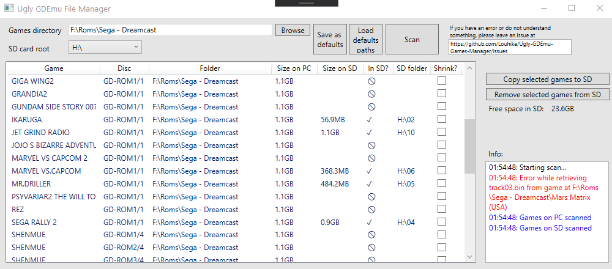

# Ugly GDEmu Games Manager

## What is Ugly GDEmu Games Manager
UGGM is a Windows (for now) software to manage your games on the SD card you have for GDEmu, as it can be cumbersome.

It allows you to:
* Copy the games from your PC on your SD card. It will find what must the name of folder (02,03 ,04, etc.) and create it. If an empty folder already exists, it will use it.
* Shrink (optionnaly) the games while copying them on your SD card. The files on your PC won't be shrinked.
* Remove Games from your SD card.
* Show which games on your PC are not on your SD card.

It also shows the free space on your SD card and the size of your games.

## What will change in future version 0.6.0 (currently in test, should be release soon)
* Files with stranges track names will work and be renamed while transfered in SD so they can work with SD Card Maker and GDEmu.
* Warning if a new version of UGGM is available.
* Use checkboxes instead of line selection to choose which games to copy/remove.
* Better performance for shrinking.

## Future

* Automatically add covers if missing from https://archive.org/details/670dreamcastgamesjewelcoverpicturesconvertedto256x256.pvrfilesforgdemu.7z

## Credits
The software is using the following tools made by others:
* "Extract Re-Build GDI's" by JCRocky5. License unknown but I asked for permission to use it. You can find his other projects here: https://github.com/Rocky5/
* "gditools" by FamilyGuy and Sizious. GNU General Public License version 3.0 (GPLv3). https://sourceforge.net/projects/dcisotools/
* "buildgdi" by S4pph4rad. http://projects.sappharad.com/tools/gdibuilder.html

Without them, this software would not exist so THANKS.

Thanks to Fed (https://github.com/PapiFed) for helping testing the software and for his nice recommandations!

## License
GNU General Public License v2.0

## If you want to support the developper
_I don't need it_ but if you would like to help pay my coffee/beer while I'm working on this, you can donate here: 
